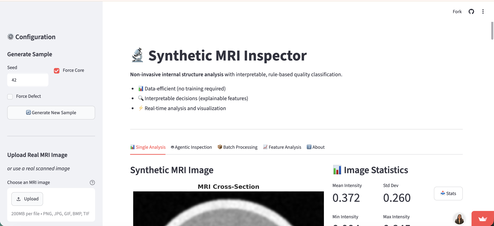
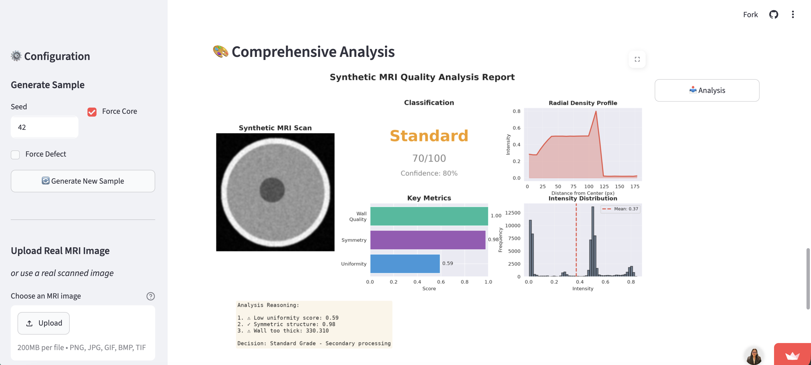
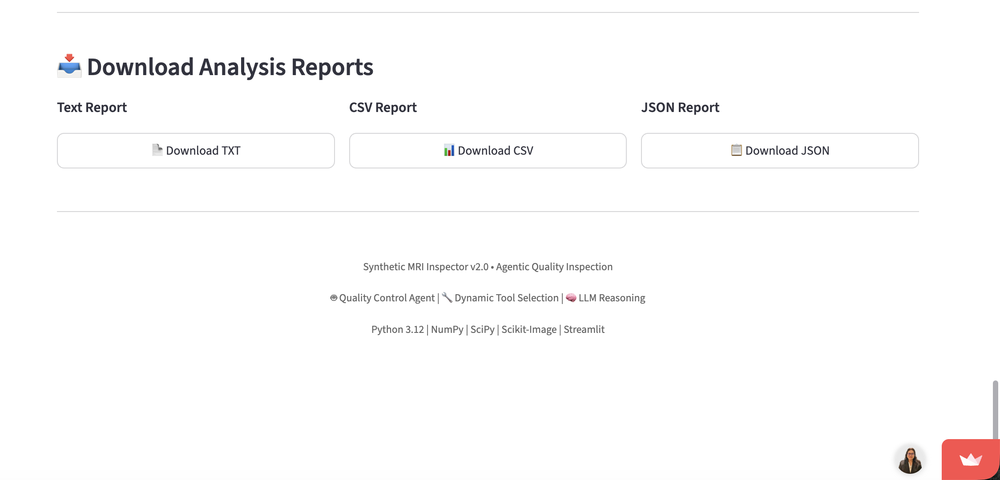
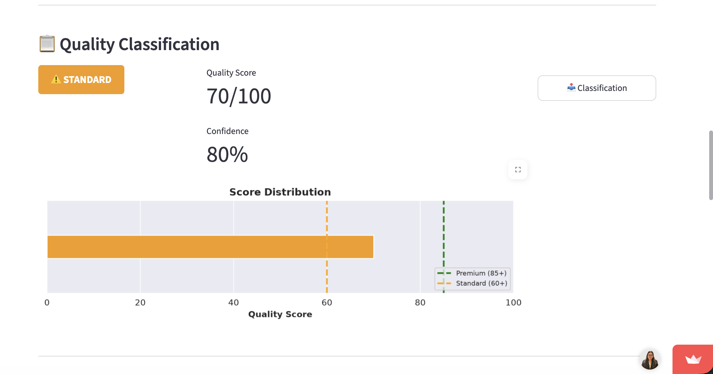

# 🔬 Synthetic MRI Insight Explorer

> **"Seeing Inside Without Cutting"** - Non-invasive internal structure analysis through data-efficient feature extraction

[](https://www.python.org/downloads/)
[](LICENSE)

A demonstration project showcasing **interpretable, data-efficient analysis** of internal structures without requiring massive datasets or black-box deep learning models.

Check Demo here - https://synthetic-mri-inspector.streamlit.app/

## Demo Screenshots

### Main Dashboard


### Quality Analysis Report


### Download Report


### Quality Classification


---

## 🎯 Project Philosophy

This project embodies three core principles:

1. **Data Efficiency** → Statistical features work with minimal samples, no training data required
2. **Interpretability** → Every decision is traceable to specific structural measurements  
3. **Actionable Insight** → Clear classifications enable immediate sorting decisions

**Why this matters**: In industrial settings (agriculture, food processing, manufacturing), you need solutions that:
- Work with limited initial data
- Provide transparent reasoning for quality control
- Deploy quickly without extensive model training
- Build stakeholder trust through explainability

---

## 🚀 What This Does

Simulates an MRI-based quality inspection system that:

1. **Generates** synthetic cross-sectional images of objects with internal structures
2. **Extracts** interpretable features (density, symmetry, wall thickness, anomalies)
3. **Classifies** quality grades with confidence scores and reasoning
4. **Visualizes** comprehensive analysis reports

### Sample Output

```
QUALITY CLASSIFICATION
==================================================

🎯 Quality: Premium
📊 Quality Score: 92.0/100
🎲 Confidence: 93.5%
✅ Decision: Premium Grade - Proceed to market

📝 Reasoning:
  1. ✓ Good uniformity: 0.78
  2. ✓ Symmetric structure: 0.82
  3. ✓ Optimal wall thickness: 0.156
  4. ✓ Well-formed core structure detected
==================================================
```

---

## 🏗️ Project Structure

```
synthetic-mri-inspector/
├── README.md                    # You are here
├── requirements.txt             # Python dependencies
├── notebooks/
│   └── exploration.ipynb        # Complete analysis workflow
├── src/
│   ├── data_generator.py        # Synthetic MRI image generation
│   ├── feature_extractor.py     # Interpretable feature extraction
│   ├── classifier.py            # Rule-based quality classifier
│   ├── visualizer.py            # Comprehensive visualizations
│   ├── quality_control_agent.py # 🤖 NEW: Agentic Quality Control
│   ├── tool_registry.py         # 🔧 NEW: Dynamic Tool Selection
│   └── llm_reasoning.py         # 🧠 NEW: LLM Reasoning Layer
└── examples/
    └── outputs/                 # Sample outputs and reports
```


---

## 📦 Installation

```bash
# Clone the repository
git clone https://github.com/yourusername/synthetic-mri-inspector.git
cd synthetic-mri-inspector

# Install dependencies
pip install numpy scipy pandas matplotlib seaborn scikit-image Pillow streamlit openai google-generativeai anthropic jupyter ipython
```

### Requirements

```
numpy>=1.20.0
matplotlib>=3.3.0
scipy>=1.6.0
scikit-image>=0.18.0
seaborn>=0.11.0
jupyter>=1.0.0
```

---

## 🎮 Quick Start

### Option 1: Jupyter Notebook (Recommended)

```bash
jupyter notebook notebooks/exploration.ipynb
```

Walk through the complete analysis pipeline interactively.

### Option 2: Python Scripts

```python
from src.data_generator import SyntheticMRIGenerator
from src.feature_extractor import FeatureExtractor
from src.classifier import QualityClassifier
from src.visualizer import MRIVisualizer

# Initialize
generator = SyntheticMRIGenerator(image_size=256)
extractor = FeatureExtractor()
classifier = QualityClassifier()
visualizer = MRIVisualizer()

# Generate and analyze
img, metadata = generator.generate_sample(seed=42)
features = extractor.extract_features(img)
classification = classifier.classify(features)

# Visualize
visualizer.plot_comprehensive_analysis(img, features, classification, 
                                      save_path='analysis_report.png')
```

---

## 🔍 Technical Approach

### 1. Synthetic Data Generation
Creates realistic MRI-like cross-sections with:
- Outer shell/wall with variable thickness
- Inner tissue with density variations
- Optional core/seed structures
- Simulated defects and anomalies
- Gaussian noise for realism

### 2. Feature Extraction

**Intensity Statistics**
- Mean, standard deviation, range
- Density distribution metrics

**Structural Features**
- Radial density profiles
- Layer detection and counting
- Wall thickness estimation
- Core structure identification

**Symmetry Analysis**
- Horizontal and vertical symmetry
- Overall structural balance

**Anomaly Detection**
- Intensity-based outlier detection
- Connected component analysis
- Severity quantification

**Quality Metrics**
- Uniformity scoring
- Spatial consistency

### 3. Rule-Based Classification

Transparent decision logic:
```python
if anomaly_severity > threshold:
    quality = "Defective"
elif uniformity < threshold or symmetry < threshold:
    quality = "Standard"
else:
    quality = "Premium"
```

Each classification includes:
- Quality grade (Premium/Standard/Defective)
- Confidence score (0-100%)
- Actionable decision
- Step-by-step reasoning

---

## 📊 Example Results

| Sample | Quality | Score | Key Features |
|--------|---------|-------|--------------|
| 1 | Premium | 92 | High uniformity, symmetric, optimal wall |
| 2 | Standard | 74 | Slight asymmetry, acceptable uniformity |
| 3 | Defective | 45 | Anomaly detected, structural irregularity |

---

## 🎯 Why This Approach Over Deep Learning?

| Aspect | This Approach | Deep Learning |
|--------|---------------|---------------|
| **Data Required** | Minimal (works immediately) | Thousands of labeled samples |
| **Interpretability** | Full transparency | Black box |
| **Deployment** | Instant | Requires training infrastructure |
| **Trust** | Stakeholders understand reasoning | "AI said so" |
| **Adaptation** | Adjust rules quickly | Retrain entire model |

**When to use Deep Learning**: When you have abundant labeled data and features are too complex for manual engineering.

**When to use this approach**: When you need quick deployment, interpretability, and data efficiency.

---

## 🔮 What Would Change with Real Data?

With actual MRI data, I would:

1. **Feature Engineering**
   - Tune features to real MRI characteristics
   - Add domain-specific measurements
   - Incorporate expert knowledge

2. **Threshold Optimization**
   - Validate against ground truth labels
   - ROC curve analysis for optimal cutoffs
   - A/B testing in production

3. **Hybrid Approach**
   - Use interpretable features as input to lightweight ML
   - Gradient boosting for complex decision boundaries
   - Keep explanability through feature importance

4. **Integration**
   - Real-time processing pipeline
   - Quality control workflow integration
   - Automated reporting systems

---

## 🎓 Learning Outcomes

This project demonstrates:

✅ Understanding of **non-invasive inspection** value proposition  
✅ **Data efficiency** in industrial ML applications  
✅ Importance of **interpretability** for stakeholder trust  
✅ **Practical deployment** considerations  
✅ Balance between **sophistication and simplicity**  

---

## 🤝 Alignment with Orbem's Mission

This project reflects Orbem's core principles:

- **Non-invasive insight**: See internal structures without destructive testing
- **Data efficiency**: Work with limited samples, scale gracefully
- **Interpretability**: Transparent reasoning for quality decisions
- **Practical impact**: Actionable classifications for real-world workflows

---

## 🤖 Agentic Upgrade (v2.0)

The system has been upgraded with three major agentic enhancements:

### Upgrade 1: Quality Control Agent

A dynamic decision-making agent that orchestrates the inspection workflow:

```python
from src.quality_control_agent import create_agent

# Create and run the agent
agent = create_agent()
result = agent.inspect(mri_image, sample_id="sample_001")

# The agent dynamically decides:
# - Which tools to run
# - Whether to escalate to deeper analysis
# - If human review is needed
print(f"Quality: {result.quality}")
print(f"Confidence: {result.confidence}%")
print(f"Human Review Required: {result.requires_human_review}")
```

**Key Features:**
- Dynamic tool selection based on intermediate results
- Confidence-based workflow escalation
- Automatic human review flagging when uncertain
- Complete decision trace for auditability

### Upgrade 2: Tool Selection (Agentic Tool Registry)

The agent intelligently selects which analysis tools to run:

```python
from src.tool_registry import get_default_registry, ToolCategory

registry = get_default_registry()

# List all available tools
print(registry.get_tools_summary())

# Tools are organized by category:
# - FEATURE_EXTRACTION: basic_intensity_extractor, symmetry_analyzer, etc.
# - ANOMALY_DETECTION: basic_anomaly_detector, deep_anomaly_scanner, etc.
# - QUALITY_ASSESSMENT: quick_quality_check, comprehensive_quality_assessment
# - REPORTING: generate_summary_report, generate_explanation_report
```

### Upgrade 3: LLM Reasoning Layer (Optional)

Add AI-powered explanations and recommendations:

```python
from src.llm_reasoning import create_reasoning_layer

# Create with auto-detection (checks for API keys in environment)
reasoning = create_reasoning_layer()

# Generate natural language explanation
explanation = reasoning.explain_decision(
    features=extracted_features,
    classification=classification_result,
    tools_used=['symmetry_analyzer', 'anomaly_detector'],
    requires_review=False
)
print(explanation)
```

**Supported LLM Providers:**
- OpenAI (GPT-4, GPT-3.5)
- Google Gemini
- Anthropic Claude
- Local rule-based fallback (no API required)

**Environment Variables:**
```bash
# Set one of these for LLM reasoning:
export OPENAI_API_KEY="your-key"
# or
export GOOGLE_API_KEY="your-key"
# or
export ANTHROPIC_API_KEY="your-key"
```

---

## 📈 Future Extensions

Potential improvements:

- [ ] Multi-class defect classification
- [ ] Temporal analysis for batch trends
- [ ] Confidence calibration studies
- [ ] Integration with actual MRI hardware
- [ ] Real-time processing optimization
- [ ] Mobile deployment for on-site inspection

---

## 📝 License

MIT License - feel free to use and adapt

---

## 🙏 Acknowledgments

Inspired by Orbem's innovative work in:
- In-ovo chicken sexing technology
- Medical imaging AI solutions
- Non-invasive quality inspection systems

---

## 📬 Contact

**Project Author**: [Moumita Basu]  
**GitHub**: [@MoumitaBasu](https://github.com/MoumitaBasu)  
**LinkedIn**: [My Linkedin](https://www.linkedin.com/in/moumitabasu97/)

---

*Built with ❤️ to demonstrate data-efficient, interpretable ML for industrial quality inspection*
